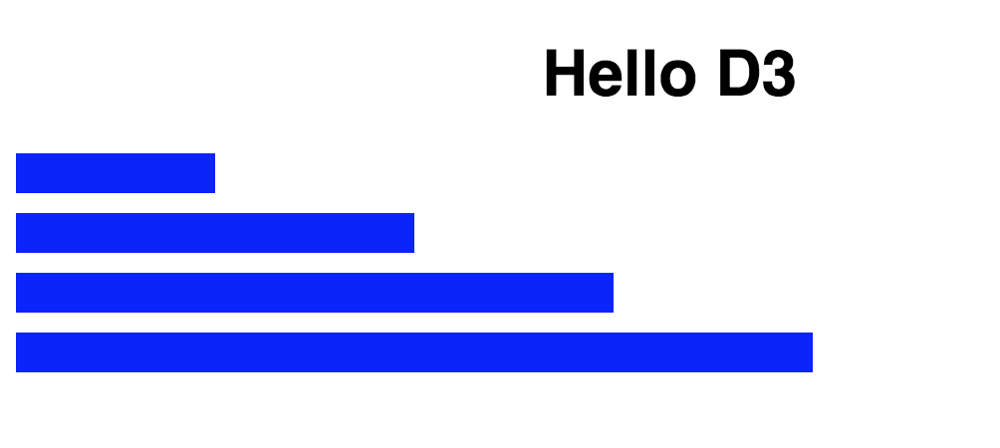

# minimal-react-d3
The bare minimum code to run react and d3 together.

# Installation

`$ git clone git@github.com:gazdagergo/minimal-react-d3.git`

`$ yarn`

`$ yarn start`

You will see something like this on `localhost:3000`:

# Thanks to

The d3 example is based on:
https://codesandbox.io/s/w41mpyv8l
